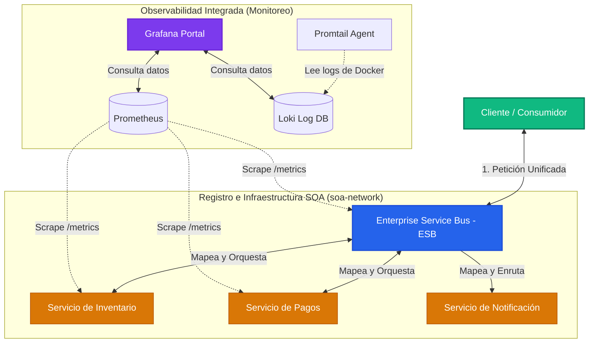
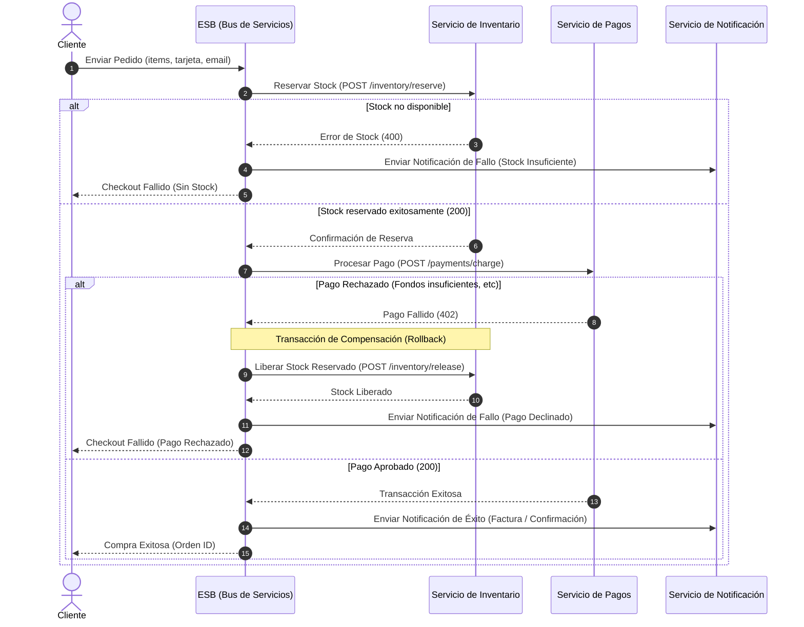

# Proyecto Arquitectura SOA - Procesador de Órdenes E-Commerce

Este repositorio contiene la entrega completa para la Tarea 2: Crear una infraestructura con estilo de arquitectura SOA.

El proyecto implementa un flujo transaccional de compras (E-Commerce Order Processor) desacoplado en microservicios, coordinado a través de un Bus de Servicios (ESB) central con soporte para transacciones de compensación (Saga Pattern) ante fallas, e integrado con un stack de observabilidad (Prometheus + Loki + Grafana), todo empaquetado y orquestado con Docker.

---

## 📂 Estructura del Repositorio (Desacoplada y Modular)

El código de cada microservicio ha sido desacoplado y estructurado de forma altamente modular para mejorar su legibilidad y mantenibilidad, separando la configuración de la aplicación de su ciclo de inicio:

*   **`client-app/`**: Cliente consumidor (HTML/CSS/JS) servido en Express.
*   **`esb-gateway/`**, **`inventory-service/`**, **`payment-service/`**, **`notification-service/`**: Microservicios y gateway del ecosistema.
    *   `server.js`: Punto de entrada ultra-limpio; únicamente levanta el servidor HTTP en el puerto parametrizado.
    *   `app.js`: Configura la aplicación Express, monta los middlewares globales de seguridad/rutas y orquesta la inicialización de métricas y Swagger UI.
    *   `config/`: Parámetros y registros lógicos (por ejemplo, URLs de servicios dependientes en el ESB).
    *   `controllers/`: Lógica de negocio pura (por ejemplo, orquestación del patrón Saga, control de stock, cobros o alertas de emails).
    *   `middlewares/`:
        *   `metrics.js`: Capturador nativo de métricas HTTP expuestas en `/metrics` para Prometheus.
        *   `swagger.js`: Módulo desacoplado para inyectar y configurar Swagger UI mediante CDN sin ensuciar la lógica del servidor.
    *   `routes/`: Definición y mapeo de endpoints.
    *   `swagger.json`: Contrato formal de API en formato OpenAPI 3.0.

---

## 🛠️ ¿Cómo funciona la Arquitectura SOA aquí?

Este sistema aplica los principios de la **Arquitectura Orientada a Servicios (SOA)** a través de un **Bus de Servicios (ESB)** que centraliza la comunicación y oculta los detalles de red y localización física:



---

## 🔄 El Patrón Saga y Flujo de Checkout

En arquitecturas distribuidas de microservicios (SOA), cada componente cuenta con su propia base de datos (o persistencia en memoria local) para garantizar un acoplamiento mínimo. Debido a esto, **no es posible utilizar transacciones atómicas ACID tradicionales de bases de datos relacionales** que involucren múltiples servicios. 

Para mantener la consistencia eventual entre sistemas independientes, implementamos el **Patrón Saga basado en Orquestación**, coordinado centralmente por el **ESB Gateway**.

### 1. Flujo del Checkout (Camino Feliz - Happy Path)
Cuando un cliente realiza un checkout a través del dashboard, el orquestador en [esb-gateway/controllers/esb.js](file:///home/mdcast/Escritorio/PrivateProjects/arquitectura/soa-project/esb-gateway/controllers/esb.js) ejecuta secuencialmente las siguientes transacciones locales:

1.  **Reserva de Stock**: Llama a `inventory-service` (`POST /inventory/reserve`). Si hay suficiente stock, el servicio descuenta temporalmente la cantidad del inventario y responde con un `reservationId`.
2.  **Cálculo y Procesamiento de Pago**: El orquestador obtiene el precio unitario del producto, calcula el total de la compra y llama a `payment-service` (`POST /payments/charge`). Si el pago se procesa correctamente, responde con un `transactionId`.
3.  **Confirmación y Notificación**: Tras el éxito de los dos pasos anteriores, la transacción se consolida y se llama a `notification-service` (`POST /notifications/send`) para enviar un email de confirmación con los detalles de la compra al usuario.

### 2. Transacción de Compensación (Rollback Transaccional)
El orquestador está diseñado para recuperarse ante fallos de manera automática ejecutando transacciones inversas de compensación (Rollback lógico):

*   **Fallo en el Inventario**: Si el producto no tiene suficiente stock o no existe, el primer paso falla de inmediato. La Saga aborta la transacción y el orquestador pide a `notification-service` que envíe un correo alertando sobre la falta de stock. No se realiza ningún cargo financiero.
*   **Fallo en el Pago**: Si el pago es declinado (por ejemplo, si el número de tarjeta inicia con `4000`, una regla simulada en nuestro backend), la transacción del paso 2 lanza una excepción. El bloque `catch` del orquestador entra en acción ejecutando la **transacción de compensación**:
    1.  **Liberación de Inventario**: Llama a `inventory-service` (`POST /inventory/release`) enviando el `reservationId`. El servicio de inventario busca la reserva, devuelve el stock correspondiente al inventario general y destruye el registro de la reserva.
    2.  **Notificación de Cancelación**: Llama a `notification-service` (`POST /notifications/send`) para enviar un email al cliente alertándole que su pago fue declinado y que el stock reservado ha sido liberado automáticamente para que otros usuarios puedan adquirirlo.



---

## 📦 Detalle de los 9 Contenedores del Ecosistema y Swagger Docs

Al levantar el proyecto, Docker inicia **9 contenedores** especializados. Los servicios SOA exponen una UI de Swagger interactiva para realizar pruebas directas:

| Contenedor | Rol SOA / Observabilidad | Puerto Host | Endpoint Swagger UI | Descripción |
| :--- | :--- | :--- | :--- | :--- |
| **`client-app`** | Cliente (Consumidor) | `3000` | *N/A* | Dashboard interactivo que simula compras y muestra la traza del ESB en tiempo real. |
| **`esb-gateway`** | Bus de Servicios (ESB) | `4000` | [`http://localhost:4000/docs`](http://localhost:4000/docs) | Gateway, ruteador y orquestador transaccional SAGA. |
| **`inventory-service`**| Proveedor de Servicio | `3001` | [`http://localhost:3001/docs`](http://localhost:3001/docs) | Gestiona el stock físico de productos, reservas y liberaciones. |
| **`payment-service`**  | Proveedor de Servicio | `3002` | [`http://localhost:3002/docs`](http://localhost:3002/docs) | Procesa y simula transacciones financieras (Mock de cobros). |
| **`notification-service`**| Proveedor de Servicio | `3003` | [`http://localhost:3003/docs`](http://localhost:3003/docs) | Encolador e historial de correos de confirmación (Mock de emails). |
| **`prometheus`**       | Monitoreo (Métricas) | `9090` | *N/A* | Recopila latencias y contadores HTTP de los endpoints `/metrics`. |
| **`loki`**             | Monitoreo (Logs DB)  | `3100` | *N/A* | Almacén unificado para buscar y filtrar logs de consola de la red. |
| **`promtail`**         | Agente de Logs       | *Interno*| *N/A* | Lee los logs de `/var/run/docker.sock` y los empuja a Loki. |
| **`grafana`**          | Monitoreo (Dashboard) | `3005` | *N/A* | Interfaz gráfica unificada con datasources de Prometheus y Loki pre-cargados. |

---

## 🚀 Cómo Iniciar la Infraestructura

Ejecuta en tu terminal en la raíz del proyecto:

```bash
docker compose up --build
```

Esto desplegará toda la red. Una vez levantada, puedes acceder a:
*   **App Cliente:** `http://localhost:3000` (Simula compras normales o compras con fallos usando tarjetas que inicien con `4000`).
*   **Grafana Dashboard:** `http://localhost:3005` (Inicia sesión con `admin`/`admin` y explora las métricas en Prometheus y los logs en tiempo real seleccionando el origen de datos Loki y filtrando por contenedor).
*   **Consola Prometheus:** `http://localhost:9090` (Visualización de métricas puras).
